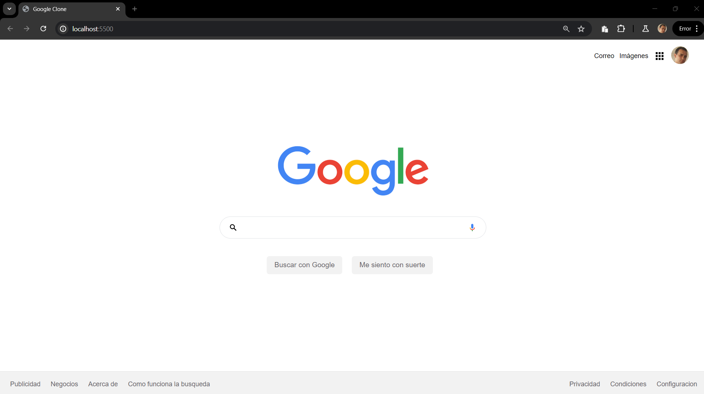

# 33-Google-Chrome-Clone
### Proyecto: Google Clone

Este proyecto es una réplica sencilla de la página principal de Google. Incluye una barra de navegación, un logo principal, un campo de búsqueda, botones de acción y enlaces de pie de página.

### Estructura del Proyecto

La estructura de archivos del proyecto es la siguiente:

```
Google Clone/
│
├── css/
│   └── main.css
│
├── images/
│   └── google_logo.png (opcional: usar una imagen local del logo de Google)
│
└── index.html
```

### Descripción de Archivos

1. **index.html**: Contiene la estructura HTML principal del clon de la página de Google.
2. **css/main.css**: Contiene los estilos CSS personalizados para el proyecto.

### Instalación

Para visualizar este proyecto, simplemente clona el repositorio y abre el archivo `index.html` en tu navegador web.

### Contribución

Si deseas contribuir a este proyecto, por favor, sigue estos pasos:

1. Haz un fork del repositorio.
2. Crea una nueva rama (`git checkout -b feature/nueva-funcionalidad`).
3. Realiza tus cambios y haz commit (`git commit -am 'Añadir nueva funcionalidad'`).
4. Sube tus cambios a la rama (`git push origin feature/nueva-funcionalidad`).
5. Crea un nuevo Pull Request.

### Licencia

Este proyecto está bajo la licencia MIT.

